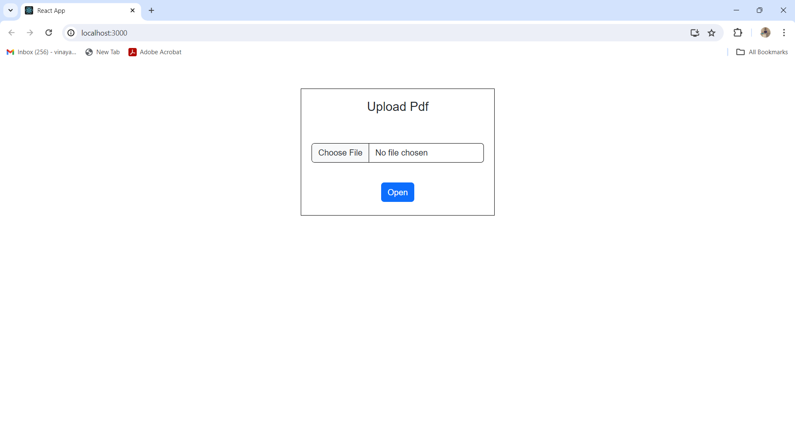

# PDF Library 

This is a PDF library that allows users to choose a PDF file UI and then open it.

## Features

- Choose a PDF file UI
- Open and view PDF files

## Getting Started

These instructions will help you get a copy of the project up and running on your local machine for development and testing purposes.

### Prerequisites

You need to have Node.js and npm installed on your machine. You can download them from [Node.js](https://nodejs.org/).

### Installation

1. Clone the repository to your local machine:
    ```bash
    git clone REPO_URL
    cd PDFVIEWERUI
    ```

2. Install the dependencies:
    ```bash
    npm install
    ```

### Running the Project

1. Start the development server:
    ```bash
    npm start
    ```

2. Open your browser and navigate to `http://localhost:3000`.


### Uploading a PDF



### Viewing a PDF


## Demo

Here is a short GIF demonstrating the main features of the application:


